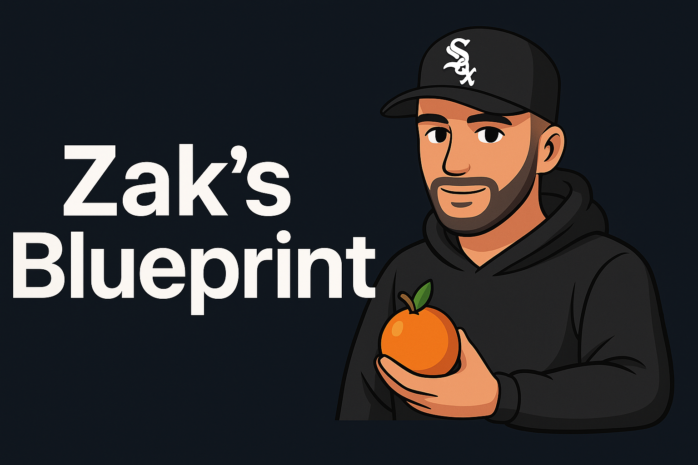

# Zak the Full-Stack Developer | 

I’m on a mission to craft solutions that make life easier and more inspired. I’m currently deep in a full-time software engineering bootcamp with the development academy, building real-world SaaS tools across finance, productivity, language, and tech; by turning bold ideas into apps that _actually work_.

---

### Tech Stack (so far)

- JavaScript (ES6+)
- React & Next.js 
- Tailwind CSS 
- Node.js + Express 
- MongoDB 
- Git & GitHub 
- Shadcn/ui 
- OpenAI API 

---

### Featured Projects

- **Zak’s Blueprint** My evolving developer portfolio (Next.js + Tailwind)
- **MicDrop** Full-stack gig platform with CRUD, auth, and MongoDB
- **Zajaik** AI-powered web audit engine with Puppeteer + OpenAI Api

---

### About Me

Ex-mortgage advisor **→** full-stack creator.  
When I’m not coding, I’m probably:

1 - Lifting in the gym  
2 - Hiking the peaks 
3 - Blending up wild smoothie combos
4 - Coding with an empire mindset 

---

###  Social Links

Coming soon... 

---

**Bold. Aspirational. Creative. Professional, with just the right splash of personality.**

  

